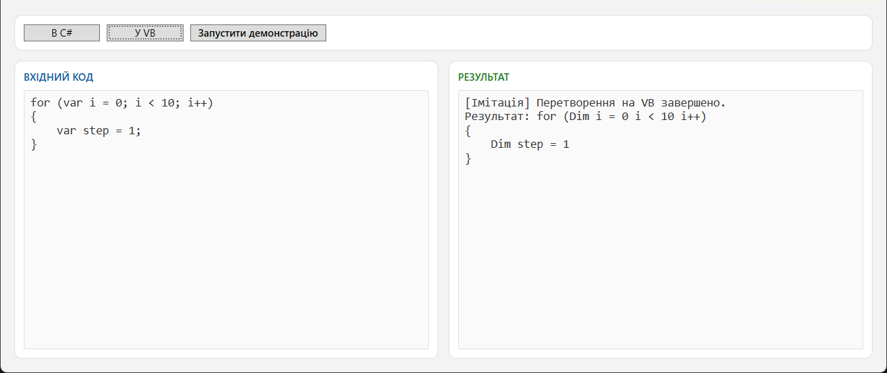
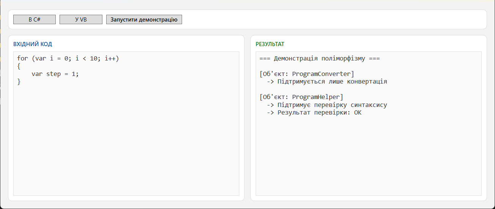

# Code Analyzer & Converter 🚀


Програмний конвертер та аналізатор коду. Програма імітує трансляцію коду між мовами C# та Visual Basic, а також перевіряє синтаксис за допомогою об'єктно-орієнтованих підходів.

## 📸 Інтерфейс програми



## ✨ Основні можливості
- **Конвертація коду**: Імітація перетворення базових конструкцій між C# та VB.
- **Перевірка синтаксису**: Валідація валідності введеного коду.
- **Демонстрація ООП**: Використання інтерфейсів (`IConvertible`, `ICodeChecker`), спадкування та поліморфізму (робота з масивами базових типів).
- **Unit-тестування**: Базова логіка та архітектурні контракти надійно покриті автоматичними тестами.
- **Сучасний UI**: Світла тема WPF із чітким розділенням вхідних даних та журналу результатів.

## 🛠 Технології та Архітектура
- **Мова**: C# 12
- **Платформа**: .NET 8.0
- **UI Фреймворк**: WPF (Windows Presentation Foundation)
- **Тестування**: xUnit
- **Шаблони**: Розділення логіки (Core) та представлення (WPF).

## 🚀 Як запустити
1. Зклонуйте репозиторій:
   ```bash
   git clone [https://github.com/твій-нік/CodeAnalyzer.git](https://github.com/твій-нік/CodeAnalyzer.git)
